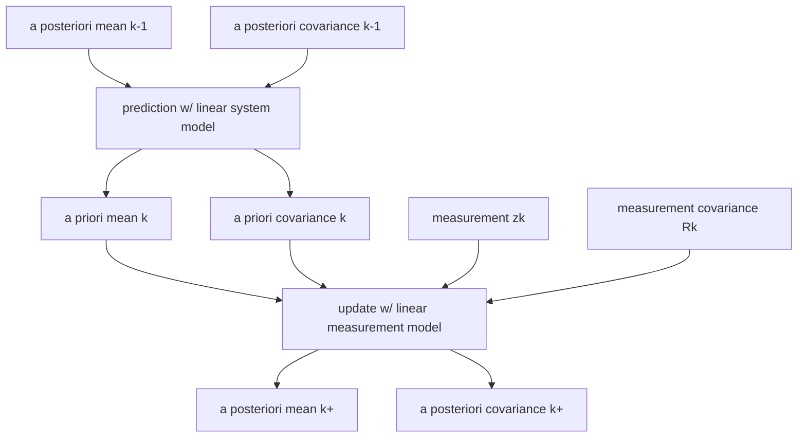

# Kalman filter
* A recursive estimator that solves the "linear-quadratic-estimation-problem"

$$ \hat{x} = E(x|z_1, z_2, ...,z_k) $$
where $z$'s are noisy measurements and $\hat{x}$ ($x$) represents the estimated (true) state. 
$$ \hat{x} = min J $$

State estimation error:
$$\tilde{x} = x - \hat{x}$$

State estimation covariance:
$$ P = [(x - \hat{x}) (x - \hat{x})^T]$$

$$ J = [(x - \hat{x})^T (x - \hat{x})] = Tr(P)$$

## Categories
* Linear KF
* Extended KF 
  - works for non-linear systems that are smooth 
* Unscented KF
  - Not linearizing the system dynamics
  - but calculates a linear approx of the uncertainty dynamics 

## How does KF work? 
* Time update (prediction step)

* a posteriori mean $\hat{x_{k-1}}^+$
* a posteriori  $\hat{P_{k-1}}^+$ 

## Discrete time system model
* Notations
  
  $x_k \sim$  state vector

  $\mu_k \sim$  control input vector
  
  $w_k \sim$ process model noise vector

  $v_k \sim$ measurement noise vector 

  $F_k \sim$ state transition matrix 

  $G_k \sim$ control input matrix 

  $H_k \sim$ measurement matrix 

  $L_k \sim$ process model noise sensitivity matrix 

  $M_k \sim$  measurement model noise sensitivity matrix 
* Process model
  $$ x_k = F_{k-1} x_{k-1} + G_{k-1} \mu_{k-1} + L_{k-1} w_{k-1} $$
  A function of current states, control inputs, and noise inputs. 
* Measurement model 
  $$ z_k = H_k x_k + M_k v_k $$
  A function of current state and some random noise in the measurement. 
* The goal is to estimate the state of the system based on the knowledge of the dynamics and \
the availability of noisy measurements 

1. a posteriori estimated state $\hat{x_k}^+$
2. a priori estimated state $\hat{x_k}^-$
3. initial state $\hat{x_0}^+$ - current best guess 

* KF uses the covariance of the estimation error to probabilistically find the updated state estimate. 