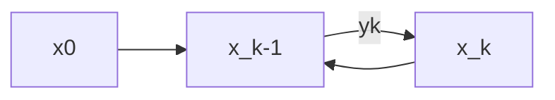

# Least Squares Estimation
## Estimation of a scaler constant 

* A system of equations
  $$ y_1 = x + v_1$$
  $$ y_2 = x + v_2$$
  $$ ... $$
  $$ y_k = x + v_k $$

So,
$$ \bar{y} = x + \frac{1}{k} \sum_{i=1}^k v_i$$ 
where the $\sum v_i$ terms gets to 0 when we have many measurements. 

Best estimate is just
$$ \hat{x} = \bar{y}$$

## Estimation of a vector constant (simple least squares)
* A system of equations
  $$ y_1 = x_1 r_1 + x_2 +  v_1$$
  $$ y_2 = x_1 r_2 + x_2 + v_2$$
  $$ ... $$
  $$ y_k = x _1 r_k + x_2 + v_k $$
* We now have two linear parameters, $x_1$ and $x_2$.
* We can write it in matrix form
  $$ y = H x + v$$
  where is the noise vector. 
* Measurement residual:
  $$ \epsilon = y - H \hat{x}$$
* Cost function
  $$ J = \sum_{i=1}^k \epsilon_i^2$$
  $$ J = \epsilon^T \epsilon = (y - H \hat{x})^T (y - H \hat{x}) $$
* Minimize the cost function w.r.t. $\hat{x}$
  
  $$\frac{\partial J}{\partial \hat{x}} = 0$$ 
  gives: 
  $$ \hat{x} = (H^T H)^{-1} H^T y $$

## Weighted least squares 

$$
\begin{bmatrix}
y_1 \\
y_2 \\
... \\
y_k \\
\end{bmatrix} =
\begin{bmatrix}
H_{11} & H_{12} & ... & H_{1n}\\
H_{21} & H_{22} & ... & H_{2n}\\
... \\
H_{k1} & H_{k2} & ... & H_{kn}\\ 
\end{bmatrix}

\begin{bmatrix}
x_1 \\
x_2 \\
... \\
x_n \\
\end{bmatrix}
+
\begin{bmatrix}
v_1\\ 
v_2 \\
... \\
v_k \\
\end{bmatrix}
$$

Assumptions:
1. $E(V) =0$
2. $E(v_i v_j^T) = 0$
3. $E(v_i ^2) = 0$
4. Covariance matrix 
$$ 
E(v v^T) = R = 
\begin{bmatrix}
\sigma_1^2 & 0 & .. & 0\\
0 & \sigma_2^2 & ... &  0\\
 ... & \\
&...\\
0& 0 & ... & \sigma_k^2 \\
\end{bmatrix} 
$$
J is now deflated by variance (uncertainty of measurement):
$$ J = \frac{\epsilon_1^2}{\sigma_1^2} + ... +  \frac{\epsilon_1^k}{\sigma_k^2} = \epsilon^T R^{-1} \epsilon $$

Note only difference is we add $R^{-1}$ here from unweighted LS. 

WLS solution:
$$ A = (H^T R^{-1} H)^{-1} H^T R^{-1} $$

Transformation of uncertainty
$$ f = Ax $$ 
$$ \sum f = A \sum x A^T $$

Solution uncertainty:

$$ P = ARA^T$$
$$(H^T R^{-1} H)^{-1}$$

## Recursive least squares 

Problem statement:
$$y_k = H_k x + v_k$$

Assumptions:
1. $E(V) =0$
2. $E(v_i v_j^T) = 0$
3. $E(v_k v_k^t) = 0$

Current best estimate = 
Previous best estimate + Differece between measurement and est. measurement
$$ \hat{x_k} = \hat{x_{k-1}} 
+ K_k (y_k - H_k \hat{x_{k-1}})
 $$
where $K_k$ is the correction gain that minimzes the least square cost function. 

Recursive estimation error:
$$ \epsilon_k = x - \hat{x_k} $$
$$ = x - \hat{x_{k-1}} - K-k (y_k - H_k \hat{x_{k-1}})$$
$$ = \epsilon_{k-1} - K_k (H_k x + v_k - H_k \hat{x_{k-1}}) $$
$$ = (I - K_k H_k) \epsilon_{k-1} - K_k v_k$$
We shoud always get less error after each recursion. 

Recursive uncertainty: 
`TO DO`

Cost function:
use trace 
$J_k = Tr(P_k)$ --> so that minizing the solution certainty minimizes the cost function 
